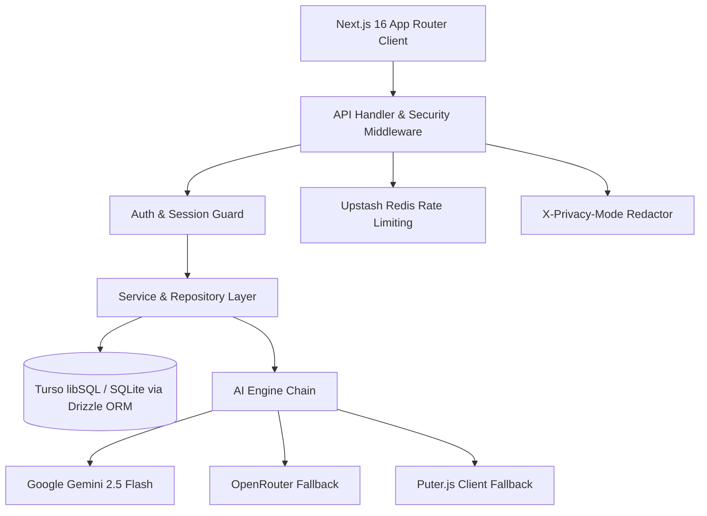

# WealthAI System Architecture

## 1. Overview
WealthAI is a privacy-first, autonomous financial intelligence platform built on modern enterprise web standards.

## 2. Core Technology Stack
| Layer | Specification |
|---|---|
| Framework | **Next.js 16.2.6**, App Router (`src/app`) |
| UI & Runtime | **React 19.2.3**, Tailwind CSS v4 (`@theme inline`), Framer Motion |
| Database | **Turso (libSQL)** via `@libsql/client`, local dev SQLite |
| ORM | **Drizzle ORM 0.45.2**, unified barrel in `src/db/schema/index.ts` |
| AI Pipeline | Primary: **Google Gemini** (`@google/generative-ai`), Fallback: **OpenRouter** / **Puter.js** |
| Cryptography | **AES-256-GCM** with authenticated tag validation (`src/lib/crypto/encryption.ts`) |
| Authentication | Session tokens, **TOTP 2FA** (`otpauth`), **WebAuthn Passkeys** (`@simplewebauthn`) |
| Rate Limiting | **Upstash Redis** sliding-window named profiles |

## 3. Modular Architecture (Modules 10–19)
The system organizes financial intelligence into ten dedicated modules:
- **Module 10**: Multi-Member Household Workspace (`/household`, `/household/[id]`)
- **Module 11**: Anonymous Peer Benchmarking with k-anonymity N ≥ 30 (`/benchmarks`)
- **Module 12**: Tax Deduction Vault & Certified Fiscal Reporting (`/tax-center`, `/tax/view/[token]`)
- **Module 13**: AI Document Vault with Semantic Vector Search (`/documents`)
- **Module 14**: Global Privacy Mode with server-side redaction & auto-lock (`/settings/privacy`)
- **Module 15**: Micro-Savings Auto-Round-Up & Escrow Sweep Engine (`/wealth-goals`, dashboard strip)
- **Module 16**: AI Statement Parser & Reconciliation Queue (`/bank-import`)
- **Module 17**: Bilingual English & Bengali Localization (`LanguageContext`, `bn.json`)
- **Module 18**: Google Calendar Synchronization & Smart Push Alerts (`/settings/calendar`)
- **Module 19**: Autonomous Agentic Actions & Unified Insights Hub (`/insights`, `/chat`)

## 4. Mobile-Desktop Parity Architecture
- **Navigation Registry**: `src/lib/navigation/registry.ts` provides a single typed source of truth for both `Sidebar.tsx` and `MobileMenu.tsx`.
- **Safe Area Insets**: Centralized `.safe-bottom` (`padding-bottom: max(0.75rem, env(safe-area-inset-bottom))`) utility.
- **Touch Targets**: Standardized minimum 44×44px hitboxes for mobile viewports.
- **Modals**: Responsive transformations (desktop centered dialogs vs. mobile full-bleed bottom sheets).
